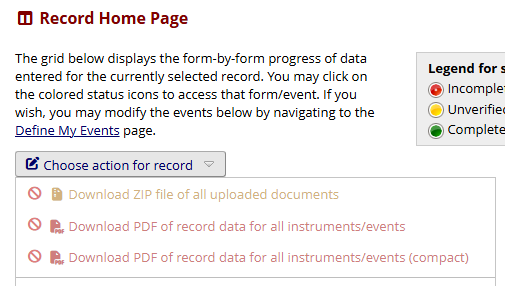

# Safe Export Restrictions (Internal Development README)

## Project Purpose

The purpose of this module is to restrict REDCap export and download functionality to approved network locations.

The current approach is based on **direct IP allowlisting**.

Desired behavior:

- Users **within approved IP ranges** → normal export/download behavior
- Users **outside approved IP ranges** → restricted export/download behavior

This module began as a proof-of-concept focused on UI blocking. The project direction has now been simplified: a **direct IP-based restriction model is sufficient** for the current need.

---

## Current Project Direction

The module is now centered on:

- Determining whether the current client IP is within an approved list or range
- Allowing normal behavior for approved IPs
- Applying restrictions for non-approved IPs
- Continuing to expand coverage for export and download vectors across REDCap

Earlier investigation into broader Safe Desktop/Citrix/browser/environment detection helped confirm options, but that is no longer the primary implementation path.

---

## Current Development Phase

### Phase 1 – UI Restriction Coverage

At the current stage, the module is primarily enforcing **UI-level restrictions** for users outside approved IP ranges.

This includes:

- Disabling targeted export/download controls
- Adding configurable tooltip messaging
- Adding warning banners/messages where appropriate
- Intercepting user interaction on blocked controls
- Expanding coverage page-by-page as export vectors are identified

These controls are intended to reduce casual or standard-path export activity while additional server-side/API enforcement is implemented where possible.

---

## IP Restriction Model

### Source of restriction logic

Restriction decisions are based on:

- A system setting containing approved IPv4 addresses and/or IPv4 ranges
- Parsing that setting into usable structures
- Comparing the current client IP against the approved list/ranges

### Rule

- **IP in approved range/list** → user is **not restricted**
- **IP not in approved range/list** → user **is restricted**

### Supported input examples

The approved IP system setting may contain values such as:

- Single IPs
- Explicit start/end ranges
- CIDR ranges
- Subnet-mask notation

Examples:

- `100.10.10.5`
- `100.10.10.5-100.10.10.25`
- `10.20.30.0/24`
- `172.16.0.0/255.255.0.0`

---

## Implemented Restrictions

## 1. Data Entry / Survey PDF Export

**Goal:** Prevent export of PDFs containing saved data for restricted users.

**Implemented:**

- Disabled targeted PDF dropdown options
- Tooltip configurable via system setting
- Click interception to prevent use of blocked items

**Status:** ✅ Implemented

---

## 2. Data Export Page

**Goal:** Restrict export-related actions on the Data Export page.

**Implemented:**

- Disabled the **Other Export Options** tab
- Added configurable messaging/banner support
- Added restrictions around export dialog follow-up actions
- Blocked/altered export-related actions for restricted users

**Status:** ✅ Implemented

---

## 3. File Repository

**Goal:** Prevent direct file exports/downloads for restricted users.

**Implemented:**

- Disabled bulk **Download** button
- Disabled individual file download links
- Disabled share/public link actions
- Added configurable banner/message
- Preserved visibility of file names where appropriate
- Added handling for PDF Snapshot Archive related controls

**Status:** ✅ Implemented

---

## 4. Logging

**Goal:** Prevent restricted users from exporting logging data.

**Implemented:**

- Disabled Logging CSV export button
- Added tooltip and ban-icon style treatment

**Status:** ✅ Implemented

---

## 5. Project Setup / Project XML Export

**Goal:** Prevent restricted users from downloading project backup/XML with data.

**Implemented:**

- Disabled Project XML export button
- Added configurable tooltip
- Added configurable banner/message

**Status:** ✅ Implemented

---

## 6. Survey Distribution Tools

**Goal:** Prevent restricted users from exporting participant and invitation-related survey data.

**Implemented:**

- Disabled survey participant export actions
- Disabled invitation log export actions
- Added tooltip and configurable banner/message

**Status:** ✅ Implemented

---

## 7. Field Comment Log

**Goal:** Prevent restricted users from exporting field comment log data.

**Implemented:**

- Disabled field comment log export button
- Added tooltip support
- Added banner placement above the field comment log section

**Status:** ✅ Implemented

---

## 8. Data Quality Resolution Export

**Goal:** Prevent restricted users from exporting Data Quality resolution data.

**Implemented:**

- Disabled the export button on `DataQuality/resolve.php`
- Targeting based on the export route rather than fragile query-string assumptions
- Supports pages whether or not `status_type` is present

**Status:** ✅ Implemented

---

## API Restriction Work

UI blocking helps reduce standard user export behavior, but API-based export paths remain an important enforcement area.

### Key point

UI blocking alone is **not sufficient** for complete protection.

### Areas of concern

Potential API-related export paths include:

- Records export
- File export
- File Repository export actions
- PDF/instrument export
- Logging export
- Project XML export
- Reports export
- Survey export

### Current status

- Proof of concept for blocking at least one API export path has already been established
- Additional API restriction coverage is still needed
- Behavior is project-dependent because EM scope follows where the module is enabled

**Status:** In progress

---

## Current Restriction Goals

This section keeps item-level tracking for development while grouping related restrictions into security-focused areas that could later become configurable options.

| Group | Item | Page / Route | Screenshot                                                                                                                 | Status |
|---|---|---|----------------------------------------------------------------------------------------------------------------------------|---|
| **Data Exports** | Data Entry PDF Export | `/DataEntry/record_home.php` and related data entry PDF export controls |                                  | Implemented |
| **Data Exports** | Data Export Page Banner / Tab Restriction | `/DataExport/index.php` |                                          | Implemented |
| **Data Exports** | Data Export Format Dialog Banner | `/DataExport/index.php` export format dialog |                              | Implemented |
| **Data Exports** | Data Export Success / Download Dialog Restrictions | `/DataExport/index.php` export success dialog |                     | Implemented |
| **Data Exports** | Data Quality Resolution CSV Export | `/DataQuality/resolve.php` |                 | Implemented |
| **Data Exports** | Data Quality Rules Export Links | `/DataQuality/index.php` |              | Implemented |
| **Data Exports** | Data Quality Rules Banner | `/DataQuality/index.php` |                                | Implemented |
| **File Exports** | File Repository Bulk Download | `/FileRepository/index.php` and file repository controller routes |                    | Implemented |
| **File Exports** | File Repository Individual File Download | `/FileRepository/index.php` and file repository controller routes |  | Implemented |
| **File Exports** | File Repository Share / Public Link Actions | `/FileRepository/index.php` and file repository controller routes |                          | Implemented |
| **File Exports** | PDF Snapshot Archive | `/index.php?route=FileRepositoryController:index&type=pdf_archive` |                                               | Implemented |
| **Audit / Review Exports** | Logging Export | `/Logging/index.php` |                                                                 | Implemented |
| **Audit / Review Exports** | Field Comment Log Export | `/DataQuality/field_comment_log.php` or related field comment log page |                                   | Implemented |
| **Project Structure / Metadata** | Project XML Export | `/ProjectSetup/index.php` and related project export/copy pages |                                                     | Implemented |
| **Survey Exports** | Survey Tools Export | Survey distribution / participant management pages |                                                  | Implemented |
| **Mobile / External Client Paths** | Mobile App Data Dumps | Mobile app-related routes |                                            | Pending |
| **Mobile / External Client Paths** | Mobile App Logs | Mobile app-related routes |                                                              | Pending |
| **API / Programmatic Access** | API – Records Export | `/api/` |                                                     | Pending |
| **API / Programmatic Access** | API – Files Export | `/api/` |                                                           | Pending |
| **API / Programmatic Access** | API – Project XML | `/api/` |                                                              | POC established |
| **API / Programmatic Access** | API – Logs | `/api/` |                                                              | Pending |
| **API / Programmatic Access** | API – Reports | `/api/` |                                                     | Pending |
| **API / Programmatic Access** | API – Surveys | `/api/` |                                                     | Pending |
### Notes

- Current implementation direction is **IP-based restriction logic**.
- Current development has been tracked at the individual item level, so each export surface remains listed separately here.
- These groups are intended to make future admin options easier to discuss, such as:
    - **Strict**: enable all groups
    - **Standard**: enable Data, File, Project Structure, and API groups
    - **Custom**: allow group-by-group selection

## Architecture Notes

Current design choices:

- JavaScript is separated into page/function-specific files
- Tooltip and banner content are configurable through system settings
- Hooks currently used include:
    - `redcap_every_page_top()`
    - `redcap_data_entry_form()`
    - `redcap_module_api_before()`
    -  `redcap_module_ajax()`
- Restriction logic is currently driven by IP range evaluation
- UI restrictions are modular and page-specific

---

## Security Notes

### What is currently covered

- UI blocking of many standard export/download paths
- IP-based decision logic for whether restrictions should apply
- Proof of concept for API blocking in at least one case

### What is not yet fully covered

- All direct HTTP/export endpoints
- All API export routes
- Full backend enforcement across every possible export path
- Centralized audit/logging of blocked attempts
- Final production hardening

This module should still be considered **in active development**, especially for backend enforcement coverage.

---

## Research Notes

- EM behavior applies within the scope of the project where the module is enabled
- API testing confirmed that module behavior can affect requests tied to a project where the EM is active
- API testing from outside that scope behaved normally
- Earlier environment/client-data collection work was useful during exploration, but the active implementation path is now direct IP-based restriction logic

---

## Next Immediate Steps

1. Continue adding UI blocks as additional export vectors are discovered
2. Expand backend/API restriction coverage where feasible
3. Clean up and standardize tooltip/banner settings
4. Decide whether session caching of restriction checks is needed or whether direct evaluation is sufficient
5. Add more production-focused documentation and testing notes

---

## Version History

- **v1.0.0** – Initial template download
- **v1.0.1** – Added new AJAX call
- **v1.0.2** – Added client page to extract browser/environment data
- **v1.0.3** – Improved interface
- **v1.0.4** – Added superuser check
- **v1.0.5** – Disabled restricted PDF options on Data Entry page
- **v1.0.6** – Moved styling into dedicated CSS file
- **v1.0.7** – Disabled “Other Export Options” tab on Data Export page
- **v1.0.8** – Added configurable tooltip text with safe parameter passing and default fallback
- **v1.0.9** – Disabled bulk Download button on File Repository page
- **v1.0.10** – Disabled individual file download links and Share button on File Repository page
- **v1.0.11** – Added customizable banner near the top of the File Repository page and added system setting support
- **v1.1.00** – Proof of concept for blocking Project XML API export
- **v1.2.00** – Added new config settings
- **v1.6.00** – Major adjustments for demo
- **v1.7.00** – Added blocks on PDF Snapshot Archive
- **v1.8.00** – Added blocks for Field Comment Log
- **v1.9.00** – Added block for Data Quality resolution CSV export
- **v1.10.00** – Added block for Mobile App - not tested - need to ensure functionality
- **v1.11.00** – Added block for Data Quality rules export and adjust message html to be in a separate container
- **v1.12.00** – Added banner on all three data export pages
- **v1.13.00** – Removed blocking of Upload tab, instead blocked the page's contents. Removed unnecessary config.json settings. Set all pages to use default HTMl and Tooltip settings
- **v1.14.00** – Fixed bug that would not block PDF downloads on the Record/form pages for subsequent events.
- **v1.15.00** – Added project override settings for message html and tooltip. Added project settings to config.json
- **v1.16.00** – Added block for Return Codes for Surveys
- **v1.17.00** – Removed project override settings for message html and tooltip. Enabled Project level -  IP, Username, and DAG ID blocking exclusions. Plus config.json text adjustments.
- **v1.18.00** – Added parsing for IP addresses on multi lines